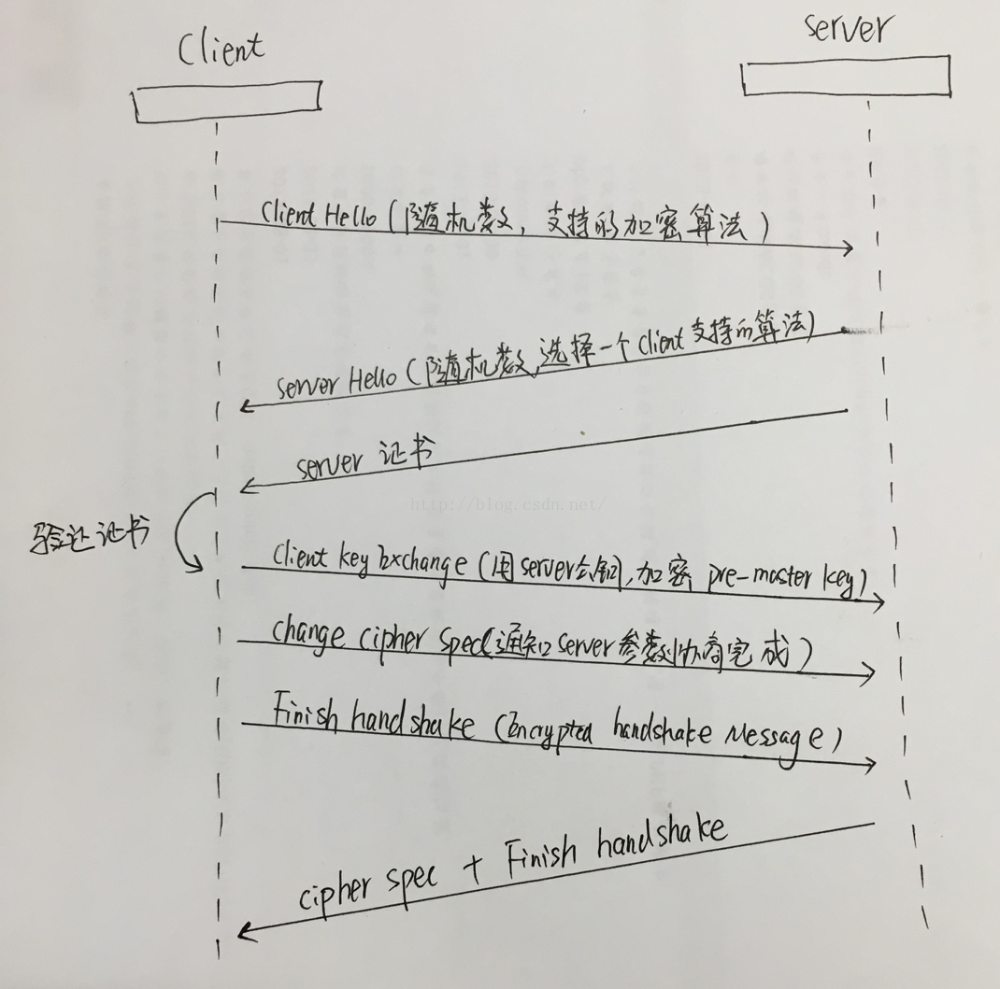
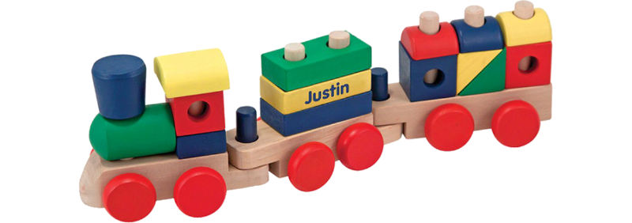

# 7层网络模型

## http协议：
[https://developer.mozilla.org/zh-CN/docs/Web/HTTP](https://developer.mozilla.org/zh-CN/docs/Web/HTTP)

## Restful

## https TLS(SSL):
[https://blog.csdn.net/hherima/article/details/52469674](https://blog.csdn.net/hherima/article/details/52469674)
[https://www.jianshu.com/p/7158568e4867](https://www.jianshu.com/p/7158568e4867)

## http2:
[https://legacy.gitbook.com/book/ye11ow/http2-explained/details](https://legacy.gitbook.com/book/ye11ow/http2-explained/details)

[https://legacy.gitbook.com/book/quafoo/http2-rfc7540-zh-cn-en/details](https://legacy.gitbook.com/book/quafoo/http2-rfc7540-zh-cn-en/details)

[https://httpwg.org/specs/rfc7540.html](https://httpwg.org/specs/rfc7540.html)

## ALPN

## TCP/UDP

## IP

## 链路

## 物理层